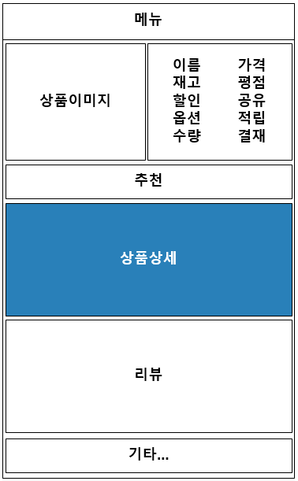
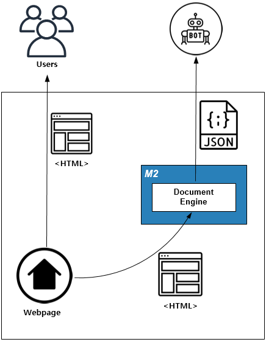

.. _appendix-decoupling:

Appendix A: 상품기술서 분리
******************

E-Commerce 상품 상세페이지는 일반적으로 다음과 같이 구성된다.

``M2`` 를 이용해 :ref:`pattern-webpage-responsive` 나 :ref:`pattern-image-split-loading` 패턴을 구현한다면 상품기술서를 메인페이지에서 분리/로딩할 것을 강력히 권장한다.

-  ``M2`` 가 페이지 전체로딩의 SPOP(Single Point Of Pain)가 되어선 안된다.
-  ``M2`` 의 도입이 단계별로 이루어질 때 전체 페이지가 영향을 받아선 안된다.
-  가격, 재고, 결재등은 서비스의 가장 민감한 정보이기 때문에 이런 정보에 ``M2`` 가 개입하는 것은 바람직하지 않다.
-  ``M2`` 가 웹페이지 전체를 로딩하는 것은 불필요한 부하이다.

로딩속도 개선은 덤이다.
**상품기술서를 웹페이지에 포함시키는 시간** 동안 엔드유저의 대기시간이 줄어든다.
   

.. note::

   이 전략을 가장 효과적으로 사용한 사이트 중 하나는 `멜론 <https://www.melon.com>`_ 이다.
   크롬이라면 ``개발자도구`` -> ``Network`` -> ``XHR`` 을 열어보자.

AS-IS
====================================

상품기술서는 별도의 스토리지(또는 데이터베이스)에 저장되어 있다. 
웹페이지가 상품기술서를 포함하고 있다면 다음과 같은 흐름으로 동작할 것이다.

.. figure:: img/rsc008.png
   :align: center

이 구조는 간단해 보이는 만큼 종속성(Dependency)가 높다.
모든 책임과 서비스 품질은 오직 Web Server와 백엔드에 달려있다.

위 구조에서 ``M2`` 가 도입되면 다음과 같다.

.. figure:: img/rsc009.png
   :align: center

종속성은 더 상승했으며 Browser는 더 많이 대기해야 된다.

TO-BE
====================================

해결하고 싶은 문제
------------------------------------
``HTTPS`` 웹페이지에서 (외부에서 제공되는) ``HTTP`` 리소스를 참조할 경우 콘텐츠가 차단된다.

-  `혼합 콘텐츠란? - Google <https://developers.google.com/web/fundamentals/security/prevent-mixed-content/what-is-mixed-content?hl=ko>`_
-  `What is mixed content? - Clourflare <https://www.cloudflare.com/learning/ssl/what-is-mixed-content/>`_

솔루션/패턴 설명
------------------------------------
``<HTML>`` 내에 존재하는 혼합 콘텐츠 문제를 클라이언트에게 전송하기 전 필터링한다. 

외부 리소스는 ``M2`` 를 통해 단일 ``HTTPS`` 도메인으로 제공된다. 
3rd Party에 의해 혼합 콘텐츠가 포함된 ``<iframe>`` 이 제공되더라도 일관되게 필터링된다.

구현
------------------------------------
-  스토리지 앞에 ``M2`` 를 배치한다. (=HTTP 통신이 가능하다.)
-  ``M2`` 혼합 콘텐츠를 필터링할 엔드포인트를 ``www.example.com`` 에 생성한다. ::
   
      # vhosts.xml - <Vhosts><Vhost><M2><Endpoints><Endpoint>

      <Model>
         <Source>https://foo.com/#model</Source>
      </Model>
      <View>
         <Source>https://bar.com/#view</Source>
      </View>
      <Control>
         <Path>/item-detail</Path>
      </Control>

-  ``M2`` View파일에 nunjucks 필터를 적용한다. ::
   
      {{ model.__raw | toHttps('/item-detail/mixed') }}

-  ``M2/STON`` 혼합 콘텐츠 게이트웨이용 가상호스트를 생성하고 ``ByClient`` 기능을 활성화한다. ::
   
      # vhosts.xml - <Vhosts>

       <Vhost Name="mixed.example.com">
          <Origin ByClient="ON" ByClientKeyword="byclient" Protocol="HTTP"/>
       </Vhost>

-  ``M2/STON`` 혼합 콘텐츠 리소스는 ``www.example.com/item-detail/mixed/..`` 로 제공된다.
   해당 URL이 ``mixed.example.com`` 에서 처리될 수 있도록 URL 전처리를 규칙을 추가한다. ::

      <URLRewrite AccessLog="Replace">
         <Pattern><![CDATA[www.example.com/item-detail/mixed/(.*)]]></Pattern>
         <Replace><![CDATA[mixed.example/byclient/#1]]></Replace>
      </URLRewrite>

-  혼합 콘텐츠가 포함된 URL을 ``M2`` URL로 변경한다. ::

      https://www.exmaple.com/item-detail?model=ITEM001&view=...

장점/효과
------------------------------------
-  마이그레이션 없이 즉시 웹 사이트에 ``HTTPS`` 를 적용한다.
-  통제할 수 없는 외부 리소스에도 일관되게 ``HTTPS`` 를 적용한다.
-  추후 보안수준이 강화되더라도 ``M2`` 를 통해 정책개선이 가능하다.

주의점
------------------------------------
현재(2020.06) 이미지등 단순 참조 리소스는 차단되지 않기 때문에 해당 콘텐츠는 배제하는 것이 효율적이다.
추후 보안검사 수준이 상향되는 경우 이미지에 대해서도 이 패턴의 사용이 가능하다. 
이 경우 발생하게되는 데이터 트래픽 처리비용에 대해 고려해야 한다.

기타
------------------------------------
SSL/TLS Offloading을 제공하는 CDN이 있다면 같이 활용할 수 있다.

웹페이지 to Web API
====================================

해결하고 싶은 문제
------------------------------------
서비스 중인 웹페이지와 타 서비스를 연동해야 한다.
Web API를 제공하고 싶지만 운영 중인 웹페이지를 수정하거나 별도의 API서비스를 구축하는 것이 부담스럽다.

솔루션/패턴 설명
------------------------------------
``M2`` 를 이용해 ``<HTML>`` 웹 페이지를 ``JSON`` 으로 실시간 맵핑한다.

`Endpoint <https://m2-kr.readthedocs.io/ko/latest/guide/endpoint.html>`_ 를 이용해 RESTful하게 API를 제공한다.

구현
------------------------------------
-  소스 웹페이지와 통신되는 영역에 ``M2`` 를 배치한다.
-  ``M2`` 엔드포인트를 설정한다. 
   모델로 게시된 웹페이지를 참조한다. ::
   
      # vhosts.xml - <Vhosts><Vhost><M2><Endpoints>

      <Endpoint>
         <Model>
            <Source>http://www.example.com/product/#model.html</Source>
            <Mapper>http://storage.com/assets/product_mapper.json</Mapper>
         </Model>
         <View ContentType="application/json">
             <Source>http://storage.com/assets/o4o/#view.json</Source>
         </View>
         <Control>
            <Path>/o4o/events/:model/:view</Path>
         </Control>
      </Endpoint>

-  ``<HTML>`` 을 ``M2-JSON`` 으로 변환할 `Mapper <https://m2-kr.readthedocs.io/ko/latest/guide/model.html#mapper>`_ 를 작성한다. ::

      {
         "branch": "#container .total_box strong, textContent, trim",
         "items": [{
            "branch": ".product_list li.item span.branch, textContent, trim",
            "dday": ".product_list li.item span.category, textContent, trim",
            "title": ".product_list li.item .tit, textContent",
            "location": ".product_list li.item p.floor, textContent",
            "period": ".product_list li.item p.date, textContent",
            "imageDataEcho": ".product_list li.item .img_thum img, attributes, data-echo, textContent",
            "imageSrc": ".product_list li.item .img_thum img, attributes, src, textContent",
            "entNo": ".product_list li.item a, attributes, value, textContent"
    }]

-  ``JSON`` 형식의 `View <https://m2-kr.readthedocs.io/ko/latest/guide/view.html>`_ 를 작성한다. ::

      {
         "timeStamp" : "{{ 'new Date().toISOString()' | eval }}",
         "branch" : "{{model.branch}}",
         "items" : [
         
         {{ "," if loop.index0 > 0 else "" }}
         {
            "branch" : "{{item.branch}}",
            "title" : "{{item.title | replace("\n", "") | replace('"', '&quot;')}}",
            "location" : "{{item.location | replace("\n", "") | replace('"', '&quot;')}}",
            "period" : "{{item.period}}",
            "imageUrl" : "{{item.imageDataEcho}}",
         }
         
         ]
      }

      
-  API 를 노출한다. ::

      https://api.exmaple.com/product/winesoft/type1

장점/효과
------------------------------------
-  즉시 가용한 API 서비스를 제공한다.
-  웹페이지가 수정되면 API에 즉시 반영된다.
-  백엔드를 연동할 필요가 없다.

주의점
------------------------------------
신규 API 서비스 구축비용의 경제성을 면밀히 따져야 한다.
만약 ``<HTML>`` 을 처리하는 과정에 복잡한 컨텍스트나 비지니스 로직이나 필요하다면 구축이 더 나은 방법일 수 있다.

기타
------------------------------------
소스 ``<HTML>`` 이 수정되는 경우 `Mapper <https://m2-kr.readthedocs.io/ko/latest/guide/model.html#mapper>`_ 를 수정할 수도 있지만 엔드포인트로 제공하는 Web API의 버전을 관리하는 것도 좋은 방법이다. ::

   http://example.com/v1/product/info.json
   http://example.com/v2/product/info.json
   http://example.com/product/v1/info.json
   http://example.com/product/v2/info.json