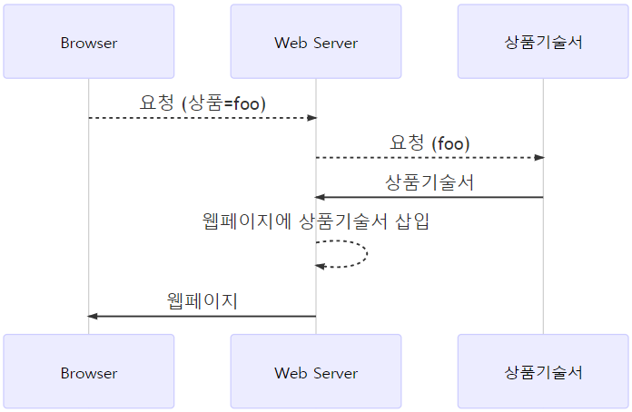

.. _appendix-decoupling:

Appendix A: 상품기술서 분리
******************

E-Commerce 상품 상세페이지는 일반적으로 다음과 같이 구성된다.

.. figure:: img/rsc007.png
   :align: center

``M2`` 를 이용해 :ref:`pattern-webpage-responsive` 나 :ref:`pattern-image-split-loading` 패턴을 구현한다면 상품기술서를 메인페이지에서 분리/로딩할 것을 강력히 권장한다.

-  ``M2`` 가 페이지 전체로딩의 SPOF(Single Point Of Failure)가 되어선 안된다.
-  ``M2`` 의 도입이 단계별로 이루어질 때 전체 페이지가 영향을 받아선 안된다.
-  가격, 재고, 결재등은 서비스의 가장 민감한 정보이기 때문에 이런 정보에 ``M2`` 가 개입하는 것은 바람직하지 않다.
-  ``M2`` 가 웹페이지 전체를 로딩하는 것은 불필요한 부하이다.

로딩속도 개선은 덤이다.
**상품기술서를 웹페이지에 포함시키는 시간** 동안 엔드유저의 대기시간이 줄어든다.
   

.. note::

   이 전략을 가장 효과적으로 사용한 사이트 중 하나는 `멜론 <https://www.melon.com>`_ 이다.
   크롬이라면 ``개발자도구`` -> ``Network`` -> ``XHR`` 을 열고 병렬로딩이 페이지 로딩속도를 어떻게 향상시키는지 알아보자.

AS-IS
====================================

상품기술서는 별도의 스토리지(또는 데이터베이스)에 저장되어 있다. 
웹페이지가 상품기술서를 포함하고 있다면 다음과 같은 흐름으로 동작할 것이다.

이 구조는 중첩관계로 인해 종속성(Dependency)이 높다.
다시 말해 상품기술서 장애가 웹페이지 전체 장애로 이어진다.

위 구조에서 ``M2`` 가 도입되면 종속성이 더 상승한다.

Browser는 아주 운좋게 백엔드 모두가 성공하는 경우에만 웹페이지를 볼 수 있다.

TO-BE
====================================

상품기술서를 프론트엔드가 로딩하면 중첩관계가 사라져 종속성이 완화된다.

로딩방식은 ``RESTful API/JSON`` , ``<iframe>`` , ``
 코드조각`` 어느 것이든 무관하다. 

.. figure:: img/rsc011.png
   :align: center

이제 ``M2`` 는 상품기술서 가공에만 집중할 수 있고 웹페이지 전체에 영향은 구조적으로 차단된다.
