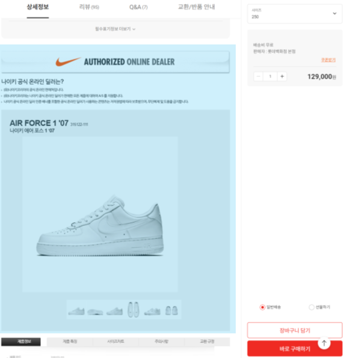
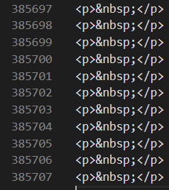
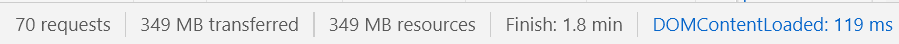
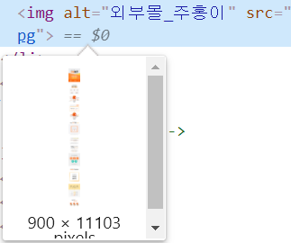
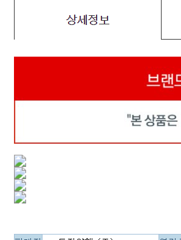
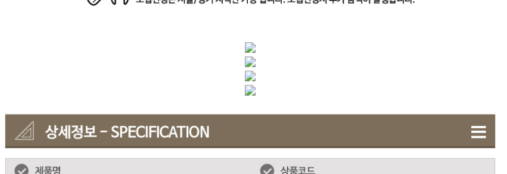
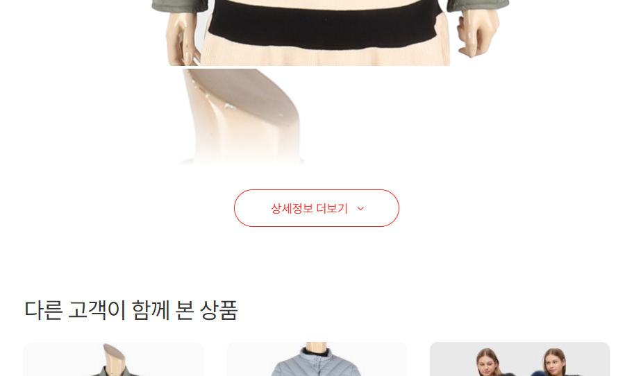
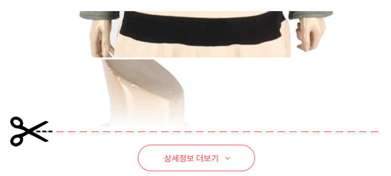
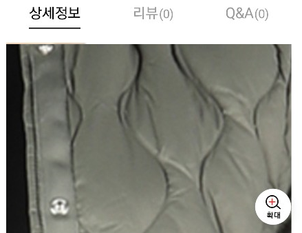

.. _appendix-itemup:

Appendix B: 상품기술서 고도화
******************

E-Commerce 서비스의 성장에 따라 취급하는 상품(=상품기술서)도 증가한다.
상품기술서(이하 기술서)의 복잡도를 공식으로 표현하면 다음과 같다. :: 

   복잡도 = 유입경로 X 양 X 시간 X 리소스 개수

기술적으로 상품기술서는 웹페이지 안의 웹페이지이다.

``M2`` 가 처리한 상품기술서 이슈 사례를 일부 소개한다.

페이지 레이아웃
====================================

페이지 레이아웃을 헤치는 대표적인 요인은 다음과 같다.

   - 사이트 개편과 오래된 상품기술서
   - 외부 상품의 대량유입
   - Shop in Shop / ``<iframe>``
   - 마이그레이션 과정 중의 버그
   - 하드코딩된 ``width=1920``

``M2 - Document Engine`` 은 on the fly로 상품기술서를 적응시킨다.

고정 해상도
------------------------------------

-  고정 ``width`` 로 인해 가시영역을 넘어간다.

   .. figure:: img/item03.png
      :align: center

-  상품기술서 내의 이미지들의 가로폭이 불규칙하다.

   .. figure:: img/item02.png
      :align: center

-  PC/타블렛/모바일 멀티 디바이스 해상도 대응이 안된다.

   .. figure:: img/item04.png
      :align: center

:ref:`pattern-webpage-responsive` 를 적용한다.

깨진 태그
------------------------------------

-  ``<HTML>`` 노출

   .. figure:: img/item06.png
      :align: center

-  인코딩 오류

   .. figure:: img/item05.png
      :align: center

DOM overflow
------------------------------------

아래 상품기술서를 로딩하면 브라우저에서 메모리 문제가 발생할 수 있다.

로딩속도 개선
====================================

외부 셀러의 상품기술서를 통제할 수 없다면 서비스 품질을 담보할 수 없다.

``이미지`` 최적화
------------------------------------

상품기술서 하나 로딩했을 뿐인데 349MB에 1.8분이 소요된다.

:ref:`pattern-image-tool-external` 을 통해 용량과 속도를 통제할 수 있다.

``이미지`` 분할/병렬로딩
------------------------------------

``height`` 1만 pixel이 넘는 이미지가 버젓이 서비스되고 있다. 

:ref:`pattern-image-split-loading` 과 브라우저 병렬로딩을 통해 로딩속도를 개선한다.

``css`` , ``js`` 압축
------------------------------------

상품기술서 내의 ``css`` , ``js`` 는 자주 바뀌지 않는다.
압축된 콘텐츠를 `캐싱 서비스 <https://m2-kr.readthedocs.io/ko/latest/guide/caching.html>`_ 하면 사용자 체감속도를 향상시킬 수 있다.

페이지 오류
====================================

진화하는 브라우징 환경에 대비해야 한다.

혼합 콘텐츠 (Mixed Contents)
------------------------------------

혼합 콘텐츠 문제가 발생하면 상품기술서는 노출되지 않는다.

:ref:`pattern-webpage-mixed-contents` 패턴을 적용한다.

.. note::

   SSL/TLS 대응이 되는 도메인은 Whitelist를 통해 예외처리가 가능하다.

deprecated, obsolete 대응
------------------------------------

플래시, 애플릿 등은 보안요소를 위협하는 요소들은 제거되어야 한다.

-  `HTML 5 - 11 Obsolete features <https://www.w3.org/TR/2014/REC-html5-20141028/obsolete.html>`_
-  `Deprecated HTML Tags <https://www.w3docs.com/learn-html/deprecated-html-tags.html>`_

``M2`` 는 상품기술서 분석을 통해 위험 요소를 제거할 수 있다.

404 Not Found
------------------------------------

존재하지 않는 이미지라면 노출시키지 않는 편이 좋다.

최신 트렌드
====================================

언제든지 모든 상품기술서를 최신 트렌드로 즉시 적응시킬 수 있다.

더 보기
------------------------------------

``M2`` 는 상품기술서의 ``Height`` 를 계산하여 선택적으로 상품기술서를 접고 펼 수 있다.

``Height`` 가 계산된 상품기술서를 캐싱하면 즉시 페이지를 완선할 수 있다.

가시영역 로딩가속
------------------------------------

`더 보기`_ 기능에 의해 먼저 노출되는 이미지 영역만을 :ref:`pattern-image-split-loading` 패턴으로 잘라내어 빠르게 노출시킨다.

모든 리소스를 다운로드 하지 않아고도 최종 페이지를 완성한다.

핀치 줌
------------------------------------

``M2`` 에서 모바일 핀치 줌 기능을 추가한다.

