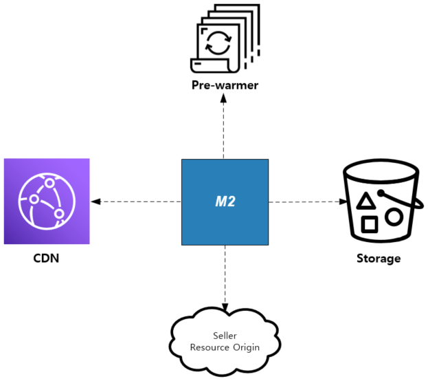

.. _appendix-traffic:

Appendix C: 이미지 트래픽과 패턴
******************

서비스는 이를 구성하는 조직구조, 역량, 스타일에 따라 제각각의 특색을 가진다.
따라서 워크로드에 대한 이해와 처리방식도 달라질 수 밖에 없다.

이 장에서는 트래픽 관점에서 대표적인 패턴의 한계와 대안에 대해 설명한다.

CDN(Contents Delivery Network)
====================================

CDN은 이미지, 동영상 등 자주 변경되지 않으면서, 용량이 큰 콘텐츠를 위탁/전송해주는 훌륭한 플랫폼이다.
CDN 도입은 콘텐츠를 제공하는 도메인을 DNS 위임(DNS delegation)하는 것으로 이루어진다.

.. figure:: img/00.png
   :align: center

예를 들어 서비스 주소가 ``www.example.com`` 이라면 ``image.example.com`` 으로 이미지 URL을 노출한다.
클라이언트가 ``image.example.com`` 질의하면 CDN 사의 전송서버(일반적으로 캐시서버)가 서비스를 담당하는 구조이다.

이미지 게이트웨이
====================================

이미지 저장은 물리적인 스토리지의 한계 또는 서비스 합병, 연계등 다양한 이유를 통해 파편화될 수 있다.
하지만 백엔드가 파편화되었다는 이유로 굳이 도메인이 ``img01.example.com`` , ``img02.example.com`` 로 파편화되어야 할까?
도메인이 추가될 때마다 CDN위임뿐만 아니라 백엔드 관리비용이 상승한다.

이때 :ref:`pattern-image-gateway` 패턴을 이용하면 다음과 같은 장점을 얻을 수 있다.

-  통합 이미지 도메인, 통합 이미지 전략
-  실시간 이미지 처리 및 캐싱
-  URL 경로 패턴에 기반한 손쉬운 백엔드 연동

.. figure:: img/00.png
   :align: center

예를 들어 이상의 패턴을 모두 통합하면 다음과 같이 이미지 URL 노출이 이루어진다. ::

   https://image.example.com/dims/resize/100/src/nas01/ab/cd/ef/1.jpg
   https://image.example.com/dims/optimize/src/s3/1234/567/89.jpg
   https://image.example.com/dims/quality/50/src/http://foo.com/2.jpg

.. note::

   M2에서는 URL 전처리를 통해 경로를 각각 가상호스트로 분리하여 운영이 가능하다.

이미지 분할로딩과 외부 트래픽 유입
====================================

:ref:`pattern-image-split-loading` 패턴을 적용할 때는 반드시 외부 트래픽 유입이 과도하게 발생하지 않는지 체크해야 한다.

.. figure:: img/00.png
   :align: center

상품기술서 내의 이미지를 분할하려면 정확한 height를 알아야 한다.
따라서 상품기술서의 모든 이미지를 M2가 위치한 백엔드로 유입시켜야 하는데 대표적인 문제점은 다음과 같다.

-  ``과도한 트래픽`` 상품기술서당 평균 10Mbps의 트래픽을 유발한다고 가정하면 100 TPS 처리를 위해서는 1Gbps가 필요하다.
   흔히 www를 서비스하는 웹서버와 같은 팜의 트래픽이 많아야 100~200Mbps 수준임을 감안하면 기가급의 트래픽이 백엔드로 유입되는건 매우 부담스러운 일이다.

-  ``보장할 수 없는 서비스 품질`` 원본서버가 외부에 있다는 것은 품질을 보장할 수 없다는 의미이다.
   클라이언트는 일부 리소스의 로딩이 느리더라도 크게 문제되지 않지만, 상품기술서의 경우 반드시 모든 리소스가 로딩된 후에 응답이 가능한 점을 감안하면 서비스 품질을 보장할 수 없게 된다.

이런 연유로 대형 오픈마켓에서는 :ref:`pattern-image-split-loading` 패턴을 그대로 대입하기는 어렵다.
반대로 브랜드몰의 경우 노출 상품의 대다수가 신뢰할 수 있는 스토리지에 있기 때문에 :ref:`pattern-image-split-loading` 패턴을 손쉽게 적용할 수 있다.

Insecure 이미지 트래픽 전략
====================================

:ref:`pattern-webpage-mixed-contents` 문제는 지금껏 지불하지 않았던 트래픽 비용을 강제한다.
트래픽을 세분화하여 접근하면 비용을 최소한으로 낮출 수 있다.

.. figure:: img/00.png
   :align: center

   1. 안전한 트래픽은 그대로 둔다.
    
      ``https`` 프로토콜을 사용하거나 ``http`` 로 명시되었지만 ``https`` 를 지원하는 URL은 굳이 Proxying하지 않는다.
      정확한 판단을 위해 M2는 `SVL(SSL/TLS Validation List) <https://m2-kr.readthedocs.io/ko/latest/guide/prditem.html#mixed-contents-svl>`_ 를 제공한다.

   2. Proxying되는 이미지에는 명확한 Cache-Control을 부여하여 유효시간을 통제한다.
      대부분의 CDN(Contents Delivery Networks)는 Cache-Control을 준수한다.

   3. Proxying되는 이미지는 용량을 최적화한다.

      과도하게 큰 용량의 이미지가 클라이언트에게 제공되지 않도록 :ref:`pattern-image-tool-external` 패턴을 적용한다. 
      낮아진 용량의 이미지는 전송비용의 감소뿐만 아니라 로딩속도 개선효과를 가져온다.

상품기술서 엔진과 이미지 엔진이 동시에 필요한 경우 이 둘을 별도의 팜으로 나누어 운영하는 것을 추천한다.
왜냐하면 운영관점에서 다음과 같이 정반대의 특성을 가지는 콘텐츠를 한 팜에서 운영할 경우 운영전략이 제한되기 때문이다.

========= ============================= ==============================
-          상품기술서 엔진                이미지 엔진
========= ============================= ==============================
배치       웹서버 앞                      CDN의 원본서버
유효시간   초~분                          시간~일
트래픽     낮음                           높음
CPU부하    높음                           낮음 (이미지 가공시 높음)
========= ============================= ==============================

공용 스토리지 적재 전략
====================================

다음 시나리오를 생각해보자.

-  원본서버의 안정성이 매우 떨어져서 서비스 품질을 보장할 수 없다.
-  원본서버를 일정 시간만 사용가능하여 캐싱된 콘텐츠가 만료되면 서비스 제공이 불가능하다.
-  콘텐츠 용량이 매우 커서 매번 외부에서 다운로드 받는 것이 부담스럽다.
-  상품기술서 렌더링해서 이미지나 PDF로 제공한다.
-  긴 동영상을 트랜스코딩 한다.

Object Storage를 공용 스토리지로 활용하면 무제한 콘텐츠 캐싱과 실시간 처리성을 극대화할 수 있다.
클라이언트와 M2 사이에 CDN이 존재한다고 가정하면 M2는 각 컴포넌트를 연결하는 허브가 된다.

-  ``CDN`` 무제한의 콘텐츠가 적재되어 클라이언트에게 서비스됨을 보장한다.
-  ``Object Storage`` 1차 저장소
-  ``Seller`` 원본 이미지를 제공한다.
-  ``Pre-warmer`` M2 구동 트리거. Pub/Sub Message Queue로 대체될 수 있다.

1. Pre-warming

   .. figure:: img/rsc013.png
      :align: center

   M2는 Pre-warmer의 호출에 의해 워크로드 처리 후 Object Stroage에 업로드 한다.
   Pre-warmer는 ``curl`` 과 같은 단순한 호출 프로그램일 수도 있으며, ``Kafa`` , ``RabbitMQ`` 등의 메시지큐인 경우 M2가 Subscriber 역할을 수행 한다.

2. Storage HIT

   .. figure:: img/rsc014.png
      :align: center

   CDN으로부터 서비스가 유입되면 M2는 Object Storage를 먼저 탐색한다.
   Object Storage에 적재되어 있다면, M2는 외부 다운로드나 가공없이 즉시 서비스 한다.

3. Storage MISS

   .. figure:: img/rsc015.png
      :align: center

   2번 시나리오를 통해 Storage MISS가 발생하는 상황으로 1번 시나리오와 동일하게 동작합니다.
   다른 점은 요청자가 CDN이기 때문에 on the fly로 처리된 콘텐츠가 CDN에 적재됨과 동시에 Object Storage로 업로드된다.
   이후 같은 콘텐츠는 Storage HIT 시나리오로 동작한다.

4. 콘텐츠 변경

   .. figure:: img/rsc016.png
      :align: center

   2가지 옵션이 가능하다.

   -  1-a는 1번 시나리오를 다시 수행한다.
   -  1-b는 2번 시나리오를 다시 수행한다.
   
   둘 중 하나를 수행한 뒤 CDN을 Purge 한다.

5. CDN MISS율 모니터링

   CDN으로부터 백엔드로 유입되는 트래픽을 주의깊게 모니터링해야 한다.

   .. figure:: img/rsc017.png
      :align: center

   위와 같은 상황은 바람직하지만 아래와 같은 상황이 발생할 경우 실시간 처리를 위한 M2의 증설 또는 ``Circuit Breaker`` 를 가동시켜 오류를 보여주는 상황이 발생하게 된다.

   .. figure:: img/rsc018.png
      :align: center

   물론 위와 같은 경우도 Object Stroage가 HIT라면 서비스 내구성엔 문제가 없다.

M2는 이미 관계 컨포넌트를 연동하는 검증된 모듈을 제공할 뿐만 아니라, 각각의 콘텐츠 트래픽을 통합 플랫폼으로 제공할 수 있다.