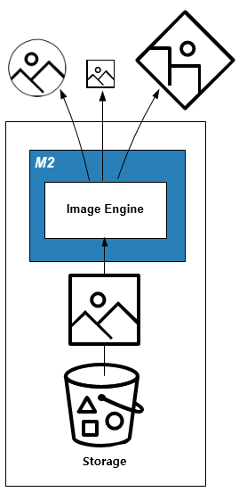
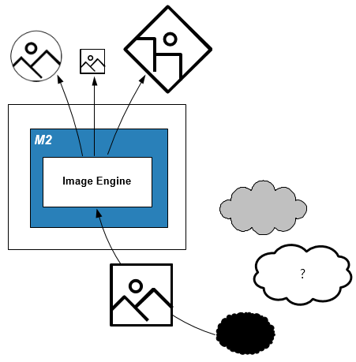
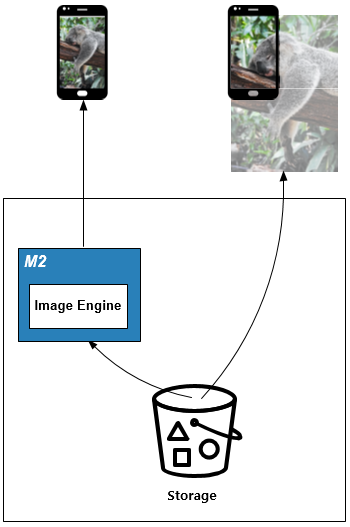

.. _pattern-image:

2장. 이미지 서비스 패턴
******************

이 장에서는 수 십억장의 이미지를 손쉽게 일괄처리하는 패턴에 대해 설명한다. 
오브젝트 스토리지 등장 이후 이미지 가용량에 대한 고민은 많이 사라졌다.
집중해야 하는 지점은 어떻게 고객에게 효과적으로 이미지를 전달할 것인가? 이다.


.. _pattern-image-tool:

실시간 이미지 가공
====================================

해결하고 싶은 문제
------------------------------------
이미지는 용도에 맞추어 다양하게 가공된다.
이미지가 늘어날수록 관리가 어려워진다. 
배치(batch) 프로세스로만으로는 더 이상 새로운 기획에 기민하게 대응할 수 없다.


솔루션/패턴 설명
------------------------------------
이미지 요청시 가공 형태를 URL에 명시한다.



``M2`` 를 통해 원본 이미지를 원하는 형태로 실시간 가공하여 전달한다.


구현
------------------------------------
-  이미지 스토리지 앞에 이미지 변환서버 용도의 ``M2`` 를 배치한다.
-  ``M2`` 이미지툴 기능을 활성화한다. ::
   
      # server.xml - <Server><VHostDefault><Options>
      # vhosts.xml - <Vhosts><Vhost><Options>

      <Dims Status="Active" Keyword="dims"/>

-  원본 이미지 URL 뒤에 원하는 가공옵션을 붙여 호출한다. ::

      http://image.example.com/origin.jpg/dims/resize/500x500/optimize


장점/효과
------------------------------------
-  원본 이미지 1장만 있다면 어떠한 이미지라도 실시간으로 만들 수 있다.
-  백엔드의 이미지 가공 시스템이 불필요해진다.


주의점
------------------------------------
``M2`` 최대 처리가능 이미지 용량(기본 10MB)을 넘거나 비정상 원본이라면 가공하지 않고 원본을 전송한다.


기타
------------------------------------
이미 사용중인 URL 패턴이 있다면 커스터마이징 모듈을 통해 호환성을 확보한다.


.. _pattern-image-tool-external:

실시간 외부 이미지 가공
====================================

해결하고 싶은 문제
------------------------------------
`실시간 이미지 가공`_ 과 유사하나 가공하고 싶은 이미지 URL이 외부 어딘가에 존재한다.


솔루션/패턴 설명
------------------------------------
외부이미지 ``힌트`` 를 포함한 URL 규칙을 정한다.



``M2`` 는 이 ``힌트`` 를 통해 원본 이미지를 다운로드 받아 가공하여 전달한다. 
``힌트`` 는 직접적으로 원본 이미지의 URL일 수 있다.


구현
------------------------------------
`실시간 이미지 가공`_ 과 동일한 방식이지만 협의된 URL 규칙을 처리하는 엔드포인트가 구성된다.


장점/효과
------------------------------------
-  어떠한 외부이미지라도 즉시 자사 서비스 스타일로 가공할 수 있다.
-  외부 이미지 장애 또는 인증서 오류 등에도 견고한 서비스가 가능하다.


주의점
------------------------------------
자사 백엔드가 아닌 만큼 신뢰할 수 없는 소스가 많을 수 있다.


기타
------------------------------------
:ref:`pattern-infra-backup` 패턴과 연계하면 외부 이미지를 스토리지에 백업할 수 있다.


이미지 용량 최적화
====================================

해결하고 싶은 문제
------------------------------------
고용량 이미지 파일이 서비스되는 경우 전송비용이 상승할 뿐만 아니라 클라이언트 서비스 품질이 저하되는 문제가 발생한다.


솔루션/패턴 설명
------------------------------------
이미지가 스토리지에 저장되면 통제가 불가능하다고 생각하는 경향이 있다. 
스토리지에 저장되기 전에 이미지 최적화 프로세스를 진행하려는 시도는 실패할 확률이 높다. 
서비스 고도화에 따라 스토리지로 향하는 입구가 많아지기 때문이다.

입구를 모두 통제할 수 없다면 단일 출구 정책을 사용하는 것이 효과적이다.


이미지서버가 이미지를 전송/배포하기 전 고용량 이미지를 최적화한다.


구현
------------------------------------
-  이미지 스토리지 앞에 ``M2`` 를 배치한다.
-  ``M2`` 이미지툴 기능을 활성화한다. (최대크기를 제한하지 않는다.) ::
   
      # server.xml - <Server><VHostDefault><Options>
      # vhosts.xml - <Vhosts><Vhost><Options>

      <Dims Status="Active" Keyword="dims" MaxSourceSize="0" />


-  ``M2`` 이미지 포맷을 대상으로 URL 전처리 규칙을 추가한다. ::

      <URLRewrite>
         <Pattern>example.com/.*\.(jpg|png).*)</Pattern>
         <Replace>example.com/#1/dims/optimize</Replace>
      </URLRewrite>

-  이미지 스토리지 도메인을 ``M2`` 로 위임한다. 


장점/효과
------------------------------------
-  기존 URL을 변경없이 사용한다.
-  항상 균일하게 최적화된 이미지 서비스가 가능하다.
-  별도의 관리/배치 프로세스 없이 이미지 처리가 자동화된다.
-  이미지 최적화 정책이 변경되더라도 무중단 정책 변경이 가능하다.
-  이미지 처리량이 많아질 경우 손쉽게 Scale-out이 가능하다.


주의점
------------------------------------

이미지 저장시 최소한의 용량 최적화는 반드시 필요하다.

-  이미지 크기가 너무 크면 자칫 스토리지 대역폭에 병목이 발생할 수 있다.
-  이미지 최적화를 위한 컴퓨팅 파워가 과도하게 투입될 수 있다.


기타
------------------------------------
-  자주 변환되는 이미지를 캐싱해 놓으면 불필요한 중복 최적화를 방지할 수 있다.


최대 이미지 해상도 제한
====================================

해결하고 싶은 문제
------------------------------------
지나치게 큰 이미지는 웹페이지 레이아웃을 파괴한다. 
어떠한 이미지라도 가로 1200px을 넘지 않도록 제한하고 싶다.


솔루션/패턴 설명
------------------------------------
이미지서버가 이미지를 전송/배포하기 전 해상도를 검사한다.



설정된 크기보다 큰 해상도라면 이미지를 축소한다.


구현
------------------------------------
-  이미지 스토리지 앞에 이미지 변환서버 용도의 ``M2`` 을 배치한다.
-  ``M2`` 이미지툴 `원본이미지 조건판단 <https://ston.readthedocs.io/ko/latest/admin/image.html#media-dims-byoriginal>`_ 을 설정한다. (최대 가로 1200px) ::
   
      # server.xml - <Server><VHostDefault><Options>
      # vhosts.xml - <Vhosts><Vhost><Options>

      <Dims Status="Active" Keyword="dims">
         <ByOriginal Name="limit-1200">
            <Condition Width="1200">/optimize</Condition>
            <Condition>/resize/1024x768/optimize</Condition>
         </ByOriginal>
      </Dims>


-  ``M2`` 다음과 같이 URL을 노출한다. ::

       http://image.example.com/koala.jpg/dims/byoriginal/limit-1200


장점/효과
------------------------------------
-  별도의 관리/배치 프로세스 없이 이미지 처리가 자동화된다.
-  최대 해상도 정책이 변경되더라도 실시간으로 적용할 수 있다.


주의점
------------------------------------
```` 처럼 태그에 고정된 값을 설정했다면 이미지 크기가 강제로 설정된다.


기타
------------------------------------
이미지 URL을 변경하고 싶지 않다면 `URL 전처리 <https://ston.readthedocs.io/ko/latest/admin/adv_vhost.html#url>`_ 를 사용한다.


.. _pattern-image-split-loading:

이미지 분할/병렬로딩
====================================

해결하고 싶은 문제
------------------------------------
상품기술서 이미지처럼 세로가 긴 이미지는 로딩 속도가 느리다.
특히 모바일 환경처럼 가시(visible)영역이 작은 경우 다운로드가 완료되기 전까지 사용자는 상품정보를 볼 수 없다.


솔루션/패턴 설명
------------------------------------
상품기술서는 독립된 HTML 조각(Snippet)으로 웹페이지에 삽입되는 경우가 일반적이다.
`m2-function-image <https://m2-kr.readthedocs.io/ko/latest/guide/view.html#m2-function-image>`_ 를 이용하면 이미지를 분할/병렬 로딩시켜 빠르게 상품기술서를 노출시킬 수 있다.


상품기술서 처리와 이미지 분할은 독립적으로 운영된다.


구현
------------------------------------
-  ``M2`` 를 HTML/이미지 스토리지 앞에 배치한다. (=HTTP 통신이 가능하다.)
-  ``M2`` 상품기술서를 처리할 엔드포인트를 생성한다. ::
   
      # vhosts.xml - <Vhosts><Vhost><M2><Endpoints><Endpoint>

      <Model>
         <Source>https://foo.com/#model</Source>
      </Model>
      <View>
         <Source>https://bar.com/#view</Source>
      </View>
      <Control>
         <Path>/productDetail</Path>
      </Control>


-  ``M2`` View파일에 ``m2-function-image`` 를 적용한다. (세로 500px을 기준으로 분할한다.) ::
   
      <html>
         <head>
            <meta name="m2-function-image" 
                  host="https://www.example.com/m2/image"
                  split-height="500">

         ... (생략)...
      </html>


-  ``M2`` 이미지처리용 가상호스트를 생성하고 이미지툴 기능을 활성화한다. ::
   
      # vhosts.xml - <Vhosts>

      <Vhost Name="image.example.com">
         <Options>
            <Dims Status="Active" Keyword="dims" MaxSourceSize="0" />
         </Options>
      </Vhost>


-  ``M2`` 이미지처리 경로 ``/m2/image/`` 가 ``image.example.com`` 을 찾아갈 수 있도록 `URL 전처리 <https://ston.readthedocs.io/ko/latest/admin/adv_vhost.html#url>`_ 를 구성한다. ::
   
      # vhosts.xml

      <Vhosts>
         ... (생략) ...

         <URLRewrite AccessLog="Replace">
            <Pattern><![CDATA[^www.example.com/m2/([^/]+)/(.*)]]></Pattern>
            <Replace><![CDATA[#1.example.com/#2]]></Replace>
         </URLRewrite>
      </Vhosts>


-  상품기술서 URL을 ``M2`` URL로 변경한다. 


장점/효과
------------------------------------
-  상품기술서 URL 변경만으로 간단히 도입이 가능하다.
-  최신(Modern) 브라우저의 병렬로딩 메커니즘을 통해 이전보다 훨씬 빠른 체감속도 개선효과를 얻을 수 있다. 


주의점
------------------------------------
너무 짧은 TTL(Time To Live)를 설정할 경우 실시간 처리비용이 높아진다. 
상품기술서는 자주 변경되지 않으니 최소 1일 이상의 TTL을 권장한다.


기타
------------------------------------
처리량이 늘어나면 `2-Tier 구조 <https://ston.readthedocs.io/ko/latest/admin/enterprise.html>`_ 도입을 고려한다.


.. _pattern-image-smartbanner:

스마트 배너 이미지
====================================

해결하고 싶은 문제
------------------------------------
판매량, 재고, 할인율처럼 지속적으로 변경되는 정보가 반영된 신선한(Fresh) 배너 이미지를 제공하고 싶다.
특히 마케팅 이메일처럼 한밤 중에 발송되고 언제 열람될지 모르는 경우 낡은(Stale) 정보가 제공된다.


솔루션/패턴 설명
------------------------------------
정보와 이미지를 동적으로 결합하여 하나의 단일한 이미지를 생성한다.


정보와 이미지의 결합형태는 언제든지 변경가능하다.


구현
------------------------------------
-  ``M2`` 를 API서버와 이미지 스토리지 앞에 배치한다. (=HTTP 통신이 가능하다.)
-  ``M2`` 정보와 이미지를 결합할 엔드포인트 ``/mybanner`` 를 생성한다. ::
   
      # vhosts.xml - <Vhosts><Vhost><M2><Endpoints><Endpoint>

      <Model>
         <Source>https://foo.com/#model</Source>
      </Model>
      <View>
         <Source>https://bar.com/#view</Source>
      </View>
      <Control>
         <Path>/mybanner</Path>
      </Control>


-  ``M2`` `View 파일 <https://m2-kr.readthedocs.io/ko/latest/guide/view.html#jpg-png-webp-bmp-pdf>`_ 을 작성하여 게시한다. 출력물은 ``JPG`` 로 한다. ::
   
      <html>
         <head>
            <meta name="m2-render-jpg" width="400" height="300">

         ... (생략)...
      </html>


-  스마트배너 URL을 배포한다. ::

      /mybanner?mode=001&view=square


장점/효과
------------------------------------
-  URL을 호출하는 시점의 신선한 정보가 배너 이미지에 반영된다.
-  이미지는 호환성이 높다. 어떠한 환경이라도 개발과정 없이 즉시 배포 가능하다.


주의점
------------------------------------
-  API 서버의 장애 또는 ``404 Not Found`` 라면 이미지를 생성할 수 없다.
-  이메일 클라이언트를 이용한다면 `제약사항 <https://mailchimp.com/help/limitations-of-html-email/>`_ 를 참고하기 바란다.


기타
------------------------------------
API서버의 시장표준 양식은 ``JSON`` 이고 ``M2`` 도 표준 포맷을 ``JSON`` 을 사용한다.
``JSON`` 형식의 API 제공이 어렵다면 `Mapper <https://m2-kr.readthedocs.io/ko/latest/guide/model.html#mapper>`_ 를 활용한다.


.. _pattern-image-gateway:

이미지 게이트웨이
====================================

해결하고 싶은 문제
------------------------------------
이미 배포된 이미지 URL과 복잡한 백엔드를 연결하기 위한 명목으로 다양한 시스템이 추가 투입된다.
게이트웨이, 이미지정보 DB/API, 변환시스템, URL 맵핑테이블, 상태관리 DB 등등 점차 확장/운영하기 어려워진다.


솔루션/패턴 설명
------------------------------------
레거시 URL규칙을 M2에 이식하여 단일 이미지 게이트웨이를 구축한다.


HTTP/S 가 지원된다면 모든 백엔드 자원을 연결하여 단일 시스템으로 구축/운영이 가능하다.


구현
------------------------------------
-  ``M2`` 이미지 게이트웨이의 역할로 백엔드 가장 앞단에 배치한다.
-  ``M2`` 레거시 이미지 URL규칙을 이식한다.
-  ``M2`` 콘텐츠 제작을 위해 연동이 필요한 백엔드를 순차적으로 연결한다.
   예제의 ``Service Call Chain`` 은 다음과 같이 동작한다.
   
   1. 호출된 URL 주소의 의미를 해석한다. M2용 Hooking 함수를 작성한다.
   2. 독립된 이미지 정보서버가 존재한다면 API를 연동하여 이미지 정보(위치와 처리방식)을 얻는다.
   3. 이미지를 다운로드 받는다. 꼭 같은 백엔드에 존재할 필요는 없다.
   4. 다운로드된 이미지를 `실시간 이미지 가공`_ 한다.

-  ``M2`` 고객에게 전달되기 전 서비스 가상호스트에 캐싱한다. 이후 같은 이미지 호출인 경우 즉시 응답한다.


장점/효과
------------------------------------
-  배포된 URL을 수정하지 않는다.
-  단일 M2플랫폼만으로 파편화된 이미지 정책과 백엔드를 통합한다.
-  이미지 산출물 뿐만 아니라 모든 연결지점에 캐싱모듈 적용이 가능하다. 
   예를 들어 API Server 가용량이 부족할 경우 증설하지 않고 캐싱으로 부하를 낮출 수 있다.
-  분산처리를 통한 병렬처리로 Scale-Out을 지원한다.


주의점
------------------------------------
-  외부 의존성에 대해서는 별도의 가상호스트로 구성해 두면 장애시 빠르게 책임규명이 가능하다.
-  캐싱정책 및 Default 동작 등을 정해두면 예측할 수 없는 경우라도 대처가 가능하다.
-  서비스 시나리오가 복잡한 만큼 블랙박스가 되지 않도록 구축/검수시 연결부위를 확인하는 매뉴얼을 작성해둔다.


기타
------------------------------------
-  레거시 URL 처리를 위해 M2는 패턴맵핑과 ``JavaScript`` 함수 연동을 제공한다.
-  실서비스 투입시 플랫폼 전면교체보다는 점진적으로 트래픽을 이전하는 것이 바람직하다. 특히 50:50의 상황에서 자원효율성등 직접적인 비교를 통해 플랫폼 신뢰도를 확보하는 것을 추천한다.