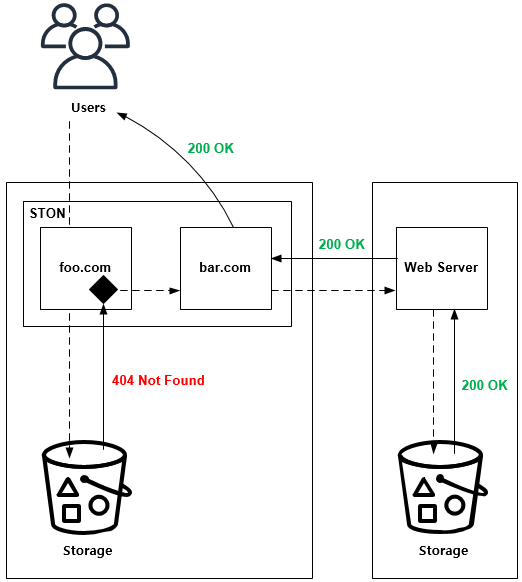
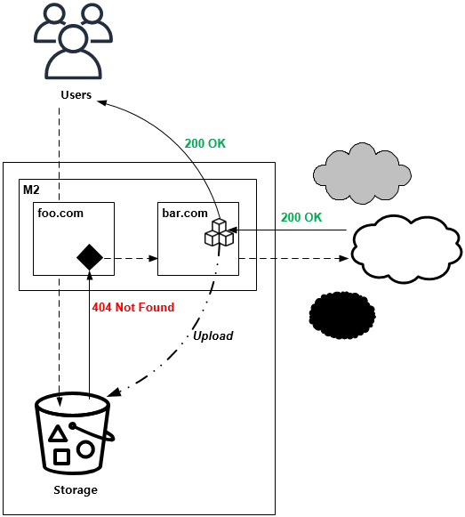
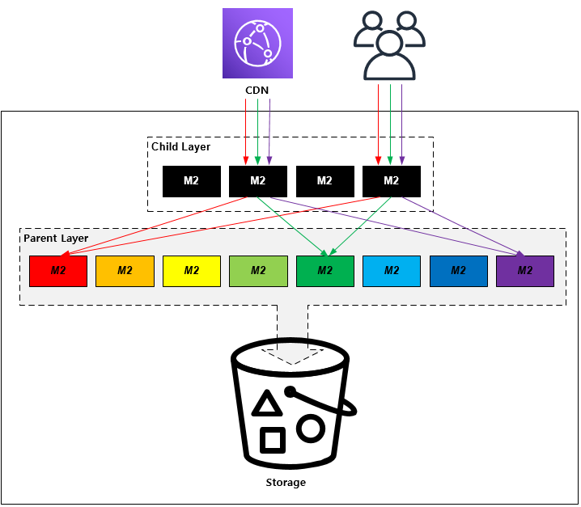

.. _pattern-infra:

인프라 구성 패턴
******************

이 장에서는 백엔드에서 손쉽게 자원들을 연결/관리하는 패턴에 대해 설명한다.
서비스 패러다임이 모놀리틱(Monolithic)에서 마이크로서비스(Microservice)로 변화하면서 통합은 더 어려워졌다.
인프라 자원들의 유연한 결합을 통해 가용량과 확장성을 손쉽게 확보한다.

콘텐츠 체인
====================================

해결하고 싶은 문제
------------------------------------
물리적으로 분산된 콘텐츠는 사용성이 매우 떨어진다. 
스토리지 마이그레이션이나 추가 개발 없이 콘텐츠 위치투명성을 확보하고 싶다.

솔루션/패턴 설명
------------------------------------
``STON`` 의 `가상호스트 링크 <https://ston.readthedocs.io/ko/latest/admin/adv_vhost.html#adv-vhost-link>`_ 기능을 이용해 물리적으로 분리된 엔드포인트를 연결한다.

구현
------------------------------------
-  메인 스토리지/서비스 앞에 ``STON`` 을 배치한다.
-  ``STON`` 개별 가상호스트를 생성하고 가상호스트 링크이미지툴 기능을 활성화한다. ::
   
      # vhosts.xml - <Vhosts>

      // foo.com에 없는(=404 Not Found) 콘텐츠는 bar.com에서 서비스한다.
      <Vhost Name="foo.com">
         <VhostLink Condition="404">bar.com</VhostLink>

         ... (생략) ...
      </Vhost>

      <Vhost Name="bar.com">
         ... (생략) ...
      </Vhost>

-  스토리지 콘텐츠가 있다면 ``foo.com`` 에서 서비스된다.
-  스토리지 콘텐츠가 없다면 ``bar.com`` 을 통해 외부에서 다운로드 받아 서비스한다.

장점/효과
------------------------------------
스토리지 마이그레이션이나 코드 수정없이 콘텐츠를 유연하게 연결할 수 있다. 
향후 별도의 스토리지나 외부 서비스를 연결해야 하는 경우에도 손쉽게 확장이 가능하다.

주의점
------------------------------------
`가상호스트 링크 <https://ston.readthedocs.io/ko/latest/admin/adv_vhost.html#adv-vhost-link>`_  는 아래의 경우 중단된다.

-  대상 가상호스트가 존재하지 않는 경우 (foo.com -> ?)
-  자기 자신을 대상 가상호스트로 지정한 경우 (foo.com -> foo.com)
-  재귀링크(Recursive Link)가 발생한 경우 (foo.com -> bar.com -> foo.com)

기타
------------------------------------
외부 콘텐츠를 캐싱하면 외부 종속성으로 인한 성능저하를 방지할 수 있다.

백업 파이프
====================================

해결하고 싶은 문제
------------------------------------
마이그레이션이 시작되면 제발 장애없이 종료되길 기도하는 것 외엔 할 수 있는 것이 없다.
물론 종료되기 전까지 서비스는 불가능하다.

솔루션/패턴 설명
------------------------------------
구성은 `콘텐츠 체인`_ 과 유사하지만 ``M2`` 의 `확장모듈 <https://m2-kr.readthedocs.io/ko/latest/guide/endpoint.html#endpoint-control-module>`_ 을 이용해 구현한다.

외부로부터의 다운로드 스트림은 3가지 파이프로 확장된다.

-  대기 중인 클라이언트에게 응답
-  스토리지 백업
-  캐싱엔진 저장

구현
------------------------------------
기본 구성은 `콘텐츠 체인`_ 과 동일하며 백업을 위해 ``M2`` `확장모듈 <https://m2-kr.readthedocs.io/ko/latest/guide/endpoint.html#endpoint-control-module>`_ 을 설정한다.  ::
   
      # vhosts.xml - <Vhosts><Vhost><M2><Endpoints><Endpoint>

      <Control>
         <Module Name="aws_s3-backup">aws_access_key=...;aws_secret_key =...;bucket=...;s3_url=...;region=...;</Module>
      </Control>

장점/효과
------------------------------------
-  마이그레이션/백업 과정없이 즉시 서비스가 가능하다.
-  사용자가 요청하는 순서대로 콘텐츠가 백업된다.

주의점
------------------------------------
사용자가 요청하지 않는 콘텐츠는 백업되지 않을 수 있으므로 스토리지에 없는 콘텐츠를 ``bar.com`` 으로 요청하는 보조 프로세스가 필요할 수 있다.

기타
------------------------------------
-  우선적으로 스토리지로 업로드하고 싶은 콘텐츠가 있다면 ``bar.com`` 을 호출하는 프로세스를 추가한다.
-  규칙만 정해져 있다면 동적으로 외부 서비스를 연결할 수 있다.

.. _pattern-infra-2tier:

2-Tier 구조
====================================

해결하고 싶은 문제
------------------------------------
모든 콘텐츠 요청이 스토리지에 집중됨에 따라 스토리지의 성능이 저하된다.
더 큰 스토리지는 근본적인 해답이 못 된다.
가용성, 성능, 경제성을 동시에 보장할 수 있는 솔루션이 필요하다.

솔루션/패턴 설명
------------------------------------
캐시를 2계층으로 구성한다.

=================== ======================================= =================================
구분                 Parent Layer                             Child Layer
=================== ======================================= =================================
캐싱대상             COLD 콘텐츠                              HOT 콘텐츠
역할                 콘텐츠 분산저장, 스토리지 부하 절감                    콘텐츠 분산
증설시점             원본 콘텐츠 증가시점                      트래픽 증가시점
=================== ======================================= =================================

구현
------------------------------------
``Child`` , ``Parent`` 는 개념적인 분류일 뿐 특별한 설정을 요구하는 것은 아니다.

-  ``Parent Layer`` 는 단순하게 원본서버로부터 캐싱한다. ::
   
      # vhosts.xml - <Vhosts>

      <Vhost Name="parent-1.example.com">
         <Origin>
            <Address>storage.example.com</Address>
         </Origin>
         <Options>
            <IfRange Purge="ON">ON</IfRange>
         </Options>
      </Vhost>

-  ``Child Layer`` 에서는 ``Parent Layer`` 의 주소로 콘텐츠를 분산하도록 설정한다. ::

      # vhosts.xml - <Vhosts>

      <Vhost Name="www.example.com">
         <Origin>
            <Address>parent-1.example.com</Address>
            <Address>parent-2.example.com</Address>
            <Address>parent-3.example.com</Address>
            <Address>parent-4.example.com</Address>
         </Origin>
         <OriginOptions>
            <BalanceMode>Hash</BalanceMode>
         </OriginOptions>
      </Vhost>

장점/효과
------------------------------------
-  스토리지 장애가 발생하여도 캐싱된 콘텐츠는 중단없이 서비스가 가능하다.
-  콘텐츠 용량/개수가 급증하여도 캐시를 Scale-out하여 손쉽게 대응할 수 있다.
-  별도의 관리 시스템이 불필요하다.

주의점
------------------------------------
``STON`` 으로 구현한다면 `블럭캐싱과 데이터 무결성 <https://ston.readthedocs.io/ko/latest/admin/enterprise.html#enterprise-block>`_ 를 참고한다.

기타
------------------------------------
변경주기가 분단위 이상이고 읽기빈도가 높다면 데이터베이스에도 도입이 가능하다.

