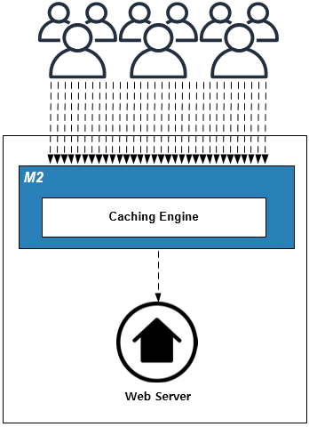
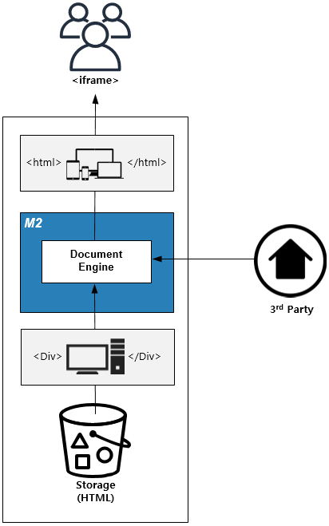
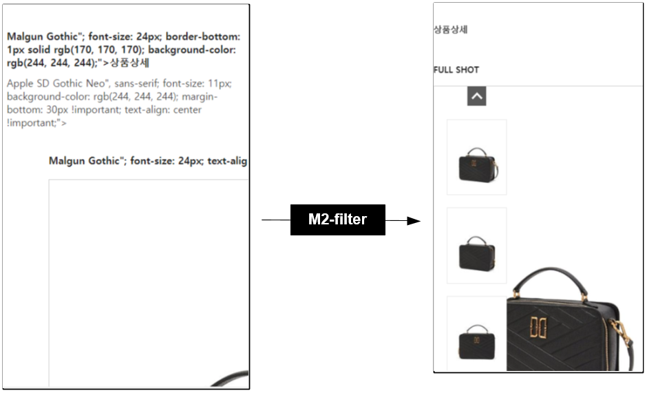

.. _pattern-performance:

서비스 퍼포먼스 패턴
******************

이 장에서는 서비스 퍼포먼스를 보장하는 패턴에 대해 설명한다.
클라이언트 접속이 높아지면 서비스 부하가 증가하는 것을 당연시 생각한다.
하지만 콘텐츠 접근비율은 읽기보다 쓰기가 압도적으로 높다.
콘텐츠의 소비형태를 파악하면 백엔드 부하를 획기적으로 절감할 수 있다.

.. _pattern-performance-constant:

고정부하
====================================

해결하고 싶은 문제
------------------------------------
순간적으로 접속자가 폭증할 경우 원본 장애가 빈번하다.
랭킹, 검색, 핫딜, 항공권 등 특정 시간에 오픈되는 서비스에 이런 경우가 많다.

솔루션/패턴 설명
------------------------------------
순간적으로 발생한 동일한 요청에 대해 최초의 결과를 공유한다.
TTL(Time To Live)을 0으로 설정하면 원본서버의 1트랜잭션 시간동안(1ms 내외)만 결과는 유효하다.

``STON`` 은 최초의 요청만 원본서버로 보내고 그 응답을 대기 중인 모든 클라이언트에게 전송하며 즉시 만료시킨다.
이 과정의 반복을 통해 접속자 수와 무관하게 원본부하를 고정시킬 수 있다.

구현
------------------------------------
-  웹서버 앞에 ``STON`` 을 배치한다. (=HTTP 통신이 가능하다.)
-  ``STON`` 모든 콘텐츠를 캐싱하고 TTL을 0으로 설정한다. ::
   
      # server.xml - <Server><VHostDefault><Options>
      # vhosts.xml - <Vhosts><Vhost><Options>

      <TTL>
         <Res2xx Ratio="20" Max="0">0</Res2xx>
         <NoCache Ratio="0" Max="0" MaxAge="0">0</NoCache>
         <Res3xx>0</Res3xx>
         <Res4xx>0</Res4xx>
         <Res5xx>0</Res5xx>
      </TTL>

장점/효과
------------------------------------
-  백엔드 부하를 고정/예측할 수 있어 서비스 안정성이 높아진다.

주의점
------------------------------------
-  읽기에는 적합하나 쓰기에는 사용할 수 없다.
-  ``STON`` 휘발성이 높은 콘텐츠에 대해서는 `Memory-Only 모드 <https://ston.readthedocs.io/ko/latest/admin/adv_topics.html#memory-only>`_ 를 권장한다.

기타
------------------------------------
로그인한 개인 페이지라도 공유할 수 있는 영역에 대해서는 ``AJAX`` 로 분리하는 것이 효과적이다.

TTL 밸브
====================================

해결하고 싶은 문제
------------------------------------
오픈마켓에서는 판매자가 상품기술서를 ``<HTML>`` 로 업로드한다.
반응형(Responsive)을 고려하지 않고 작성된 ``<HTML>`` 은 레이아웃과 사용자 경험을 망친다.
흔히들 사용하는 배치작업을 통한 마이그레이션에는 치명적인 문제가 있다.

-  기획이 변경되면 다시 마이그레이션해야 한다.
-  외부에서 참조되는 리소스는 통제가 불가능하다.

솔루션/패턴 설명
------------------------------------
전송시점에 상품기술서 ``<HTML>`` 를 반응형(Responsive)으로 수정한다.

부모 페이지의 ``CSS`` / ``JavaScript`` 등과 충돌되지 않도록 ``<iframe>`` 으로 삽입한다.

.. note::

   ``<iframe>`` 에 대한 막연한 우려에 대해 접하곤 한다.
   하지만 ``<iframe>`` 은 명백히 ``HTML5`` 표준이다. 
   유튜브, 챗봇, 리뷰, 추천등 SaaS(Software As A Service) 연동이 ``<iframe>`` 기반으로 서비스되고 있음을 상기하자.

구현
------------------------------------
-  상품기술서 스토리지 앞이나 외부 기술서 참조가 가능한 지점에 ``M2`` 를 배치한다. (=HTTP 통신이 가능하다.)
-  ``M2`` 상품기술서 엔드포인트를 생성한다. ::
   
      # vhosts.xml - <Vhosts><Vhost><M2><Endpoints><Endpoint>

      <Model>
         <Source>https://foo.com/#model</Source>
      </Model>
      <View>
         <Source>https://bar.com/#view</Source>
      </View>
      <Control>
         <Path>/item-detail</Path>
      </Control>

-  ``M2`` View파일에 상품기술서에 적용할 ``CSS`` 와 필터를 적용한다. 
-  프론트엔드에서 반응형 상품기술서를 AJAX로 삽입한다. ::

      https://www.exmaple.com/item-detail?model=ITEM001&view=responsive

장점/효과
------------------------------------
-  상품기술서를 일일이 수정하지 않고 페이지 레이아웃/UX를 개선할 수 있다.
-  프론트엔드 스타일 충돌없이 도입이 가능하다.
-  지속적으로 상품기술서 정책을 보강할 수 있다.

주의점
------------------------------------
기존 상품기술서를 삽입하는 방식과 스타일 충돌여부를 미리 살펴야 한다.

기타
------------------------------------
마이그레이션 과정 중 깨진 상품기술서에 대한 보정도 가능하다.

