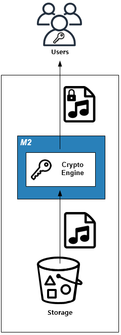
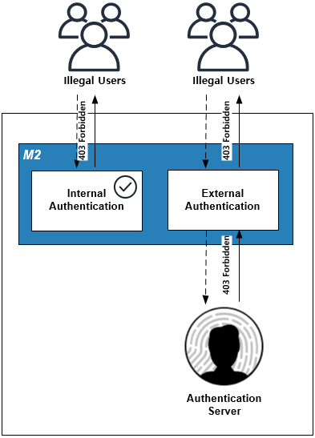
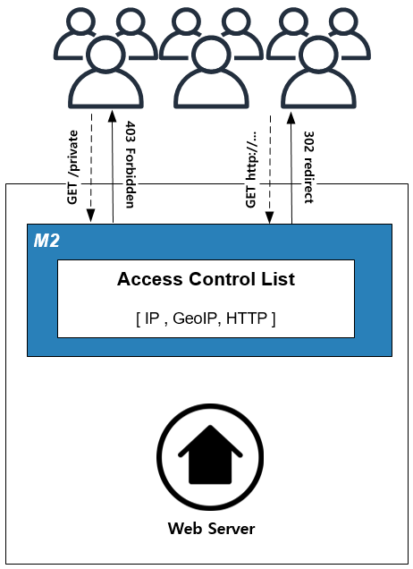

.. _pattern-security:

7장. 보안 패턴
******************

이 장에서는 콘텐츠를 보호하는 패턴에 대해 설명한다.
보안(Security)의 범주는 매우 크기 때문에 다소 과하게 다루어지는 면이 있다.
용도와 목적에 알맞은 해법은 콘텐츠의 안정성과 비용을 합리적으로 다룰 수 있도록 해준다.

.. _pattern-security-drm:

라이브 DRM
====================================

해결하고 싶은 문제
------------------------------------
콘텐츠 보호를 위해 DRM(Digital Right Management)을 고려해 보았지만 비용과 운영관점에서 지나치게 무겁다.
운영이 쉽고 가볍게 도입할 수 있는 End To End 콘텐츠 암/복호화 시스템을 구축하고 싶다.

솔루션/패턴 설명
------------------------------------
콘텐츠 전송시점에 암호화를 수행하고 콘텐츠 재생시점에 복호화를 수행한다.

암호화 키는 주고받지 않으며 양 주체가 약속된 알고리즘에 의해 키를 생성한다.
키의 시드(seed) 중 하나로 URL을 사용하여 모든 콘텐츠의 키를 다르게 사용한다.

구현
------------------------------------
-  스토리지 앞에 ``M2`` 를 배치한다. (=HTTP 통신이 가능하다.)
-  On the fly DRM 기능을 활성화한다. ::
   
      $ server.xml - <Server><VHostDefault><Options>
      $ vhosts.xml - <Vhosts><Vhost><Options>

      <Drm Status="Aactive" Keyword="drm" MaxSourceSize="500">
         <Algorithm>RC4</Algorithm>
         <IV> ... </IV>
         <Token> ... </Token>
         <Key Hash="none">$Token</Token>
      </Drm>

-  DRM 주소를 배포한다. 또는 모든 콘텐츠 주소뒤에 ``/drm`` 이 붙도록 `URL 전처리 <https://ston.readthedocs.io/ko/latest/admin/adv_vhost.html#url>`_ 를 설정한다. ::

      www.example.com/music.mp3/drm

장점/효과
------------------------------------
-  콘텐츠를 암호화하여 근본적으로 안전하다.
-  백엔드와 DRM 솔루션을 타이트하게 결합하지 않아도 같은 효과를 얻을 수 있다.
-  모든 콘텐츠가 다른 키를 사용하며 언제든지 변경이 가능하다.

주의점
------------------------------------
암호화 레벨설계시 타겟 모바일 디바이스의 복호화 성능을 고려해야 한다.

기타
------------------------------------
-  대칭키/비대칭키 모두 사용이 가능하다. 
-  성능을 고려하여 콘텐츠가 전체가 아닌 일부 영역만 선택적으로 암호화할 수 있다.

.. _pattern-security-auth:

요청 인증
====================================

해결하고 싶은 문제
------------------------------------
클라이언트 HTTP 요청을 분석하여 올바른 접근에 대해서만 콘텐츠를 서비스하고 싶다.

솔루션/패턴 설명
------------------------------------
서비스 최전방에서 인증을 구현한다.

인증은 크게 인라인모듈과 인증서버로 구분된다.

-  ``내부 인증모듈`` - 알고리즘/스펙에 의해 요청의 유효성을 즉시 판단한다.
-  ``외부 인증모듈`` - 요청 전체 또는 일부 토큰을 인증서버로 보내 유효성 여부에 대해 판단 받는다.

인증이 성공했다면 정상적인 서비스 플로우로 진행도니다.

구현
------------------------------------
-  스토리지 앞에 ``M2`` 를 배치한다. (=HTTP 통신이 가능하다.)
-  ``M2`` `확장모듈 <https://m2-kr.readthedocs.io/ko/latest/guide/endpoint.html#endpoint-control-module>`_ 을 이용해 인증로직을 구현한다. ::

장점/효과
------------------------------------
-  인증과 로직, 콘텐츠를 분리하여 처리한다.
-  기존 인증시스템을 그대로 사용한다.

주의점
------------------------------------
인증서버가 SPOF(Single Point Of Failure)가 되지 않도록 가용량을 고려해서 설계한다.

기타
------------------------------------
인증과 `Trimming <https://ston.readthedocs.io/ko/latest/admin/video.html#trimming>`_ 을 결합하면 미리듣기 서비스를 손쉽게 구현할 수 있다.

.. _pattern-security-acl:

접근제어 (Access Control)
====================================

해결하고 싶은 문제
------------------------------------
특정 클라이언트의 HTTP 요청을 차단, 우회, 허가하고 싶다.

솔루션/패턴 설명
------------------------------------
접근제어 계층을 웹서버 앞에 두어 요청을 통제한다.

``IP`` , ``GeoIP`` , ``URL`` , ``HTTP-Header`` , ``Protocol`` 등의 조건을 조합하여 White/Black 리스트를 구성한다.

구현
------------------------------------
-  스토리지 앞에 ``M2`` 를 배치한다. (=HTTP 통신이 가능하다.)
-  `ACL(Access Control List) <https://ston.readthedocs.io/ko/latest/admin/access_control.html>`_ 을 구성한다.

장점/효과
------------------------------------
-  접근제어를 별도 서비스 계층으로 분리하여 운영성을 강화한다.
-  ``HTTP`` 또는 ``HTTPS`` 프로토콜을 강제할 수 있다.

주의점
------------------------------------
모든 트래픽이 ``M2`` 를 경유하는 만큼 웹서버에 구현된 모든 가상호스트 목록이 ``M2`` 에 존재해야 한다.

