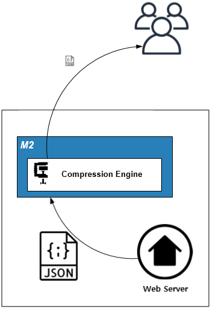

.. _pattern-traffic:

4장. 트래픽 최적화 패턴
******************

이 장에서는 서비스 트래픽을 다루는 패턴에 대해 설명한다.
개별 콘텐츠나 트랜잭션에 대해서는 개발팀의 영역이지만 트래픽이라는 단어가 사용되면서 운영팀의 업무로 성격이 바뀐다.
따라서 운영의 시각으로 문제를 바라보는 것이 좋다.

써킷 브레이커(Circuit Breaker)
====================================

해결하고 싶은 문제
------------------------------------
백엔드(웹서버, 스토리지, 데이터베이스) 장애에도 동작하는 서비스를 구축하고 싶다.

솔루션/패턴 설명
------------------------------------
캐시서버는 원본서버의 상태를 일정시간(Time To Live)동안 저장한 뒤 대신 응답하는 메커니즘이다.

.. figure:: img/dgm013.png
   :align: center

원본 장애발생시 캐싱된 콘텐츠의 TTL을 자동으로 늘려주어 장애를 노출시키지 않는다.

구현
------------------------------------
-  보호하고 싶은 서비스 앞에 ``STON`` 을 배치한다. (=HTTP 통신이 가능하다.)
-  ``STON`` 서비스(=가상호스트)별로 적절한 TTL을 설정한다. ::
   
      # server.xml - <Server><VHostDefault><Options>
      # vhosts.xml - <Vhosts><Vhost><Options>

      <TTL>
          <Res2xx Ratio="20" Max="86400">1800</Res2xx>
          <NoCache Ratio="0" Max="60" MaxAge="0">30</NoCache>
          <Res3xx>300</Res3xx>
          <Res4xx>5</Res4xx>
          <Res5xx>5</Res5xx>
      </TTL>

-  ``STON`` 장애 상황에서 원본 오동작으로 ``4xx`` , ``5xx`` 응답이 올 수 있다. 
   콘텐츠가 캐시에서 사라지지 않도록 `비정상 TTL연장 <https://ston.readthedocs.io/ko/latest/admin/caching_policy.html#id4>`_ 기능을 활성화시킨다. ::

      # server.xml - <Server><VHostDefault><Options>
      # vhosts.xml - <Vhosts><Vhost><Options>

      <TTLExtensionBy4xx>ON</TTLExtensionBy4xx>
      <TTLExtensionBy5xx>ON</TTLExtensionBy5xx>
      <UnvalidatableObjectResCode>0</UnvalidatableObjectResCode>

.. note::

   ``STON`` 은 콘텐츠 갱신시점에 원본서버와 연결이 안되거나 전송지연이 발생할 경우 자동으로 TTL을 연장한다.

장점/효과
------------------------------------
캐싱된 콘텐츠라면 장애가 클라이언트에게 노출되지 않는다.

주의점
------------------------------------
엔터프라이즈 서비스에서는 L4/Load Balancer등을 이용해 장애서버를 배제한다.
캐시서버 운영도 동일한 방식을 사용한다.

기타
------------------------------------
자주 변경되는 콘텐츠라면 ``TTL`` 을 0초로 설정한다.
평상시에는 대부분의 응답을 원본서버에서 처리하다 장애상황이 발생하면 캐시서버가 대신 응답한다.

압축
====================================

해결하고 싶은 문제
------------------------------------
웹서버는 동일한 1,000건의 요청에 대해 1,000번 압축한다.
빈번하게 요청되는 웹페이지, API를 압축하여 전송하고 싶지만 지금도 높은 부하가 우려된다.

솔루션/패턴 설명
------------------------------------
``STON`` 은 동일한 1,000건의 요청에 대해 최초 1번만 압축하고 TTL 시간동안은 압축된 결과물을 전송한다.

구현
------------------------------------
-  서비스 앞에 ``STON`` 을 배치한다. (=HTTP 통신이 가능하다.)
-  ``STON`` 압축기능을 활성화한다. ::
   
      # server.xml - <Server><VHostDefault><Options>
      # vhosts.xml - <Vhosts><Vhost><Options>

      <Compression Method="gzip" Level="6" SourceSize="2-2048">ON</Compression>

-  ``STON`` 압축대상을 지정한다. ::

      # /svc/www.example.com/compression.txt
      # 구분자는 콤마( , ) 이다.
      # {URL 조건}, {Method}, {Level} 순서로 표기한다.

      /sample.css, no       // 압축하지 않는다.
      *.css                 // *.css 조건에 대해 기본 Method와 Level로 압축한다.
      *.htm, gzip           // *.htm 조건에 대해 gzip으로 압축한다. (기본 Level)
      *.xml, , 9            // *.xml 조건에 대해 Level 9로 압축한다. (기본 Method)
      *.js, gzip, 5         // *.js 조건에 대해 gzip (Level=5)으로 압축한다.

장점/효과
------------------------------------
-  한번 요청된 콘텐츠라면 별도의 압축비용 없이 빠른 서비스 제공이 가능하다.
-  bootstrap 등 많이 쓰이는 프론트엔드 콘텐츠를 압축하면 70% 이상의 대역폭 절감효과를 얻을 수 있다.

주의점
------------------------------------
이미지, 동영상등은 그 자체가 압축포맷이라 효과를 기대할 수 없다.

기타
------------------------------------
원본서버에서 이미 압축된 콘텐츠라면 다시 압축하지 않는다.

