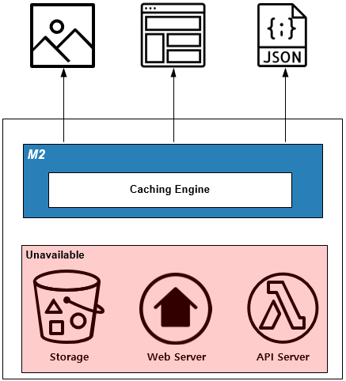

.. _pattern-traffic:

트래픽 최적화 패턴
******************

작성 예정입니다.

써킷 브레이커(Circuit Breaker)
====================================

해결하고 싶은 문제
------------------------------------
백엔드(웹서버, 스토리지, 데이터베이스) 장애에도 동작하는 서비스를 구축하고 싶다.

솔루션/패턴 설명
------------------------------------
캐시서버는 원본서버의 상태를 일정시간(Time To Live)동안 저장한 뒤 대신 응답하는 메커니즘이다.

원본 장애발생시 저장된 콘텐츠의 TTL을 자동으로 늘려주어 장애를 노출시키지 않는다.

구현
------------------------------------
-  보호하고 싶은 서비스 앞에 ``STON`` 을 배치한다. (=HTTP 통신이 가능하다.)
-  ``STON`` 서비스(=가상호스트)별로 적절한 TTL을 설정한다. ::
   
      # server.xml - <Server><VHostDefault><Options>
      # vhosts.xml - <Vhosts><Vhost><Options>

      <TTL>
          <Res2xx Ratio="20" Max="86400">1800</Res2xx>
          <NoCache Ratio="0" Max="60" MaxAge="0">30</NoCache>
          <Res3xx>300</Res3xx>
          <Res4xx>5</Res4xx>
          <Res5xx>5</Res5xx>
      </TTL>

-  ``STON`` 장애 상황에서 원본 오동작으로 ``4xx`` , ``5xx`` 응답이 올 수 있다. 
   콘텐츠가 캐시에서 사라지지 않도록 `비정상 TTL연장 <https://ston.readthedocs.io/ko/latest/admin/caching_policy.html#id4>`_ 기능을 활성화시킨다. ::

      # server.xml - <Server><VHostDefault><Options>
      # vhosts.xml - <Vhosts><Vhost><Options>

      <TTLExtensionBy4xx>ON</TTLExtensionBy4xx>
      <TTLExtensionBy5xx>ON</TTLExtensionBy5xx>

.. note::

   ``STON`` 은 콘텐츠 갱신시점에 원본서버와 연결이 안되거나 전송지연이 발생할 경우 자동으로 TTL을 연장한다.

장점/효과
------------------------------------
캐싱된 콘텐츠라면 장애가 클라이언트에게 노출되지 않는다.

주의점
------------------------------------
엔터프라이즈 서비스에서는 L4/Load Balancer등을 이용해 장애서버를 배제한다.
캐시서버 운영도 동일한 방식을 사용한다.

기타
------------------------------------
자주 변경되는 콘텐츠라면 ``TTL`` 을 0초로 설정하여 평상시에는 원본서버에 의존하다 장애상황에서만 동작하도록 구현한다.

HTTPS 리다이렉트(Redirect)
====================================

압축
====================================

전송대역폭 조절
====================================

API 게이트웨이(Gateway)
====================================