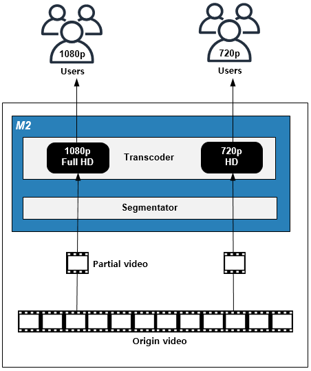

.. _pattern-video:

동영상 서비스 패턴
******************

이 장에서는 동영상을 빠르고 호환성있게 전달하는 패턴에 대해 설명한다.
동영상 서비스에서는 :ref:`pattern-infra-2tier` 가 기본이 될 만큼 엄청난 저장공간과 전송대역폭을 필요로 한다.
막대한 비용이 지출되는 만큼 어떻게 안정적이고 경제적인 서비스를 구성할 것인가에 초점을 맞추어야 한다.

실시간 HLS 전송
====================================

해결하고 싶은 문제
------------------------------------
아이폰을 기준으로 시장표준 동영상 전송방식은 HLS(Http Live Streaming)이다.
이미 스토리지에 MP4포맷으로 저장된 수 많은 영상을 HLS의 미디어 포맷인 MPEG2-TS로 분할(Segmentation)하기에는 시간과 공간의 제약이 크다.

솔루션/패턴 설명
------------------------------------
``STON`` 의 `MP4HLS <https://ston.readthedocs.io/ko/latest/admin/video.html#mp4-hls>`_ 기능을 이용해 실시간으로 MP4영상을 HLS로 가공하여 전송한다.

.. figure:: img/dgm011.png
   :align: center

구현
------------------------------------
-  동영상 스토리지/서비스 앞에 ``STON`` 을 배치한다.
-  ``STON`` MP4HLS 기능을 활성화한다. ::
   
      # vhosts.xml - <Vhosts><Vhost><Media>

      <MP4HLS Status="Active" Keyword="mp4hls">
         <Index Ver="3" Alternates="off">index.m3u8</Index>
         <Sequence>0</Sequence>
         <Duration>10</Duration>
         <AlternatesName>playlist.m3u8</AlternatesName>
      </MP4HLS>

-  플레이어에서 기존 동영상 URL 뒤에 ``/mp4hls/index.m3u8`` 를 붙여 호출한다. ::

      http://www.example.com/video.mp4/mp4hls/index.m3u8

장점/효과
------------------------------------
별도의 백엔드 프로세스나 추가 저장공간의 소비 없이 즉시 HLS 서비스가 가능하다.

주의점
------------------------------------
포맷변경/분할(Segmentation)과 트랜스코딩(transcoding)을 혼동하지 말자.

기타
------------------------------------
사용자가 동영상 전체를 시청하는 빈도가 낮다면 ``STON``  - `Range요청 <https://ston.readthedocs.io/ko/latest/admin/origin.html#range>`_ 기능을 이용해 스토리지/원본서버의 대역폭 소비를 최소화한다.

실시간 구간편집
====================================

해결하고 싶은 문제
------------------------------------
고객은 영상 전체보다 이슈 장면만 선별적으로 소비한다.
복잡한 사전작업 없이 이슈 즉시 편집된 영상을 제공하고 싶다.

솔루션/패턴 설명
------------------------------------
``STON`` 의 `Multi-Trimming <https://ston.readthedocs.io/ko/latest/admin/video.html#multi-trimming>`_ 기능을 이용해 실시간으로 MP4영상을 편집한다.

구현
------------------------------------
-  동영상 스토리지/서비스 앞에 ``STON`` 을 배치한다.
-  ``STON`` `Multi-Trimming <https://ston.readthedocs.io/ko/latest/admin/video.html#multi-trimming>`_ 기능을 활성화한다. ::
   
      # server.xml - <Server><VHostDefault><Media>
      # vhosts.xml - <Vhosts><Vhost><Media>

      <MP4Trimming MultiParam="trimming" MaxRatio="50">ON</MP4Trimming>
      <M4ATrimming MultiParam="trimming">ON</M4ATrimming>

-  플레이어에서 기존 동영상 주소 뒤에 원하는 구간을 초단위로 명시한다. ::

      http://example.com/video.mp4?trimming=10-70

장점/효과
------------------------------------
별도의 백엔드 프로세스나 추가 저장공간의 소비 없이 즉시 편집된 동영상 서비스가 가능하다.

주의점
------------------------------------
`ngx_http_mp4_module <http://nginx.org/en/docs/http/ngx_http_mp4_module.html>`_ 이나 `Mod-H264-Streaming-Testing-Version2 <http://h264.code-shop.com/trac/wiki/Mod-H264-Streaming-Testing-Version2>`_ 같은 사용방식을 원한다면 ``STON`` - `Trimming <https://ston.readthedocs.io/ko/latest/admin/video.html#trimming>`_ 을 사용한다.

기타
------------------------------------
`실시간 HLS 전송`_ 과 같이 사용할 수 있다. ::

   http://example.com/video.mp4?trimming=17-20,30-40/mp4hls/index.m3u8

On Demand Transcoding
====================================

해결하고 싶은 문제
------------------------------------
전형적인 동영상 배포 프로세스는 많은 단계를 거친다. ::

   1. 업로드
   2. 스토리지/원본
   3. 배치프로세스
   4. 트랜스코더 (1080p, 720p, 360p)
   5. 스토리지/가공
   6. 웹서버
   7. CDN

이 과정의 대표적인 단점은 아래와 같다.

-  스토리지 사용량 증가
-  배치프로세스 백엔드 구축/운영비용
-  트랜스코더 도입/운용 비용
-  배포지연. 중요도 순이 아닌 FIFO(First Input First Out) 구조.
-  연계서비스의 어려움

솔루션/패턴 설명
------------------------------------
``M2`` 를 이용해 동영상이 소비되는 영역만 분할하여 트랜스코딩/전송한다.

영상을 미리 생성해두지 않아도 다음과 같이 소비되는 영역에 대해서만 트랜스코딩/전송/소비가 동시에 이루어진다.

장점/효과
------------------------------------
단계가 다음과 같이 축소된다. ::

   1. 업로드
   2. 스토리지/원본
   3. M2 (분할 트랜스코딩)
   4. CDN

-  원본이외에 스토리지를 사용하지 않는다.
-  배치프로세스가 필요 없다.
-  업로드 즉시 배포가 가능하다.
-  이미지 추출을 통한 2차 가공물을 생산할 수 있다.
-  이미지/비디오 플랫폼을 통합할 수 있다.

주의점
------------------------------------
원본 영상이 MP4(H.264/AAC)가 아니라면 업로드 단계의 영상 트랜스코딩이 필요하다.
