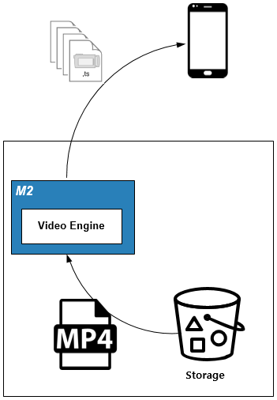
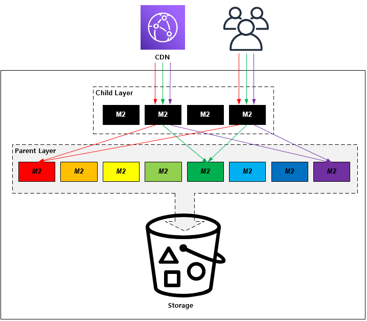

.. _pattern-video:

동영상 서비스 패턴
******************

이 장에서는 동영상을 빠르고 호환성있게 전달하는 패턴에 대해 설명한다.
동영상 서비스에서는 :ref:`pattern-infra-2tier` 구조가 기본이 될 만큼 엄청난 저장공간과 전송대역폭을 필요로 한다.
막대한 비용이 지출되는 만큼 어떻게 안정적이고 경제적인 서비스를 구성할 것인가에 초점을 맞추어야 한다.

실시간 HLS 전송
====================================

해결하고 싶은 문제
------------------------------------
iOS를 기준으로 시장표준 동영상 전송방식은 HLS(Http Live Streaming)이다.
이미 스토리지에 MP4포맷으로 저장된 수 많은 영상을 MPEG-TS로 분할하기에는 시간과 공간의 제약이 크다.

솔루션/패턴 설명
------------------------------------
``STON`` 의 `MP4HLS <https://ston.readthedocs.io/ko/latest/admin/video.html#mp4-hls>`_ 기능을 이용해 실시간으로 MP4영상을 HLS로 가공하여 전송한다.

구현
------------------------------------
-  동영상 스토리지/서비스 앞에 ``STON`` 을 배치한다.
-  ``STON`` MP4HLS 기능을 활성화한다. ::
   
      # vhosts.xml - <Vhosts><Vhost><Media>

      <MP4HLS Status="Active" Keyword="mp4hls">
         <Index Ver="3" Alternates="off">index.m3u8</Index>
         <Sequence>0</Sequence>
         <Duration>10</Duration>
         <AlternatesName>playlist.m3u8</AlternatesName>
      </MP4HLS>

-  플레이어에서 기존 동영상 주소 뒤에 ``~/mp4hls/index.m3u8`` 를 붙여 호출한다. ::

      http://www.example.com/video.mp4/mp4hls/index.m3u8

장점/효과
------------------------------------
별도의 백엔드 프로세스나 추가 저장공간의 소비 없이 즉시 HLS 서비스가 가능하다.

주의점
------------------------------------
``STON`` 은 MP4에 대한 트랜스코딩(transcoding)을 수행하지 않는다. 
따라서 원본 동영상의 Video/Audio를 다른 Bitrate로 재가공할 수 없다.

기타
------------------------------------
사용자가 동영상 전체를 시청하는 빈도가 낮다면 ``STON``  - `Range요청 <https://ston.readthedocs.io/ko/latest/admin/origin.html#range>`_ 기능을 이용해 스토리지/원본서버의 대역폭 소비를 최소화한다.

백업 파이프
====================================

해결하고 싶은 문제
------------------------------------
마이그레이션이 시작되면 제발 장애없이 종료되길 기도하는 것 외엔 할 수 있는 것이 없다.
물론 종료되기 전까지 서비스는 불가능하다.

솔루션/패턴 설명
------------------------------------
구성은 `콘텐츠 체인`_ 과 유사하지만 ``M2`` 의 `확장모듈 <https://m2-kr.readthedocs.io/ko/latest/guide/endpoint.html#endpoint-control-module>`_ 을 이용해 구현한다.

.. figure:: img/dgm009.png
   :align: center

외부로부터의 다운로드 스트림은 3가지 파이프로 확장된다.

-  대기 중인 클라이언트에세 응답
-  스토리지 백업
-  캐싱엔진 저장

구현
------------------------------------
기본 구성은 `콘텐츠 체인`_ 과 동일하며 백업을 위해 ``M2`` `확장모듈 <https://m2-kr.readthedocs.io/ko/latest/guide/endpoint.html#endpoint-control-module>`_ 을 설정한다.  ::
   
      # vhosts.xml - <Vhosts><Vhost><M2><Endpoints><Endpoint>

      <Control>
         <Module Name="aws_s3-backup">aws_access_key=...;aws_secret_key =...;bucket=...;s3_url=...;region=...;</Module>
      </Control>

장점/효과
------------------------------------
-  마이그레이션/백업 과정없이 즉시 서비스가 가능하다.
-  사용자가 요청하는 순서대로 콘텐츠가 백업된다.

주의점
------------------------------------
사용자가 요청하지 않는 콘텐츠는 백업되지 않을 수 있으므로 스토리지에 없는 콘텐츠를 ``bar.com`` 으로 요청하는 보조 프로세스가 필요할 수 있다.

기타
------------------------------------
-  우선적으로 스토리지로 업로드하고 싶은 콘텐츠가 있다면 ``bar.com`` 을 호출하는 프로세스를 추가한다.
-  규칙만 정해져 있다면 동적으로 외부 서비스를 연결할 수 있다.

2-Tier 구조
====================================

해결하고 싶은 문제
------------------------------------
모든 콘텐츠 요청이 스토리지에 집중됨에 따라 스토리지의 성능이 저하된다.
더 큰 스토리지는 근본적인 해답이 못 된다.
가용성, 성능, 경제성을 동시에 보장할 수 있는 솔루션이 필요하다.

솔루션/패턴 설명
------------------------------------
캐시를 2계층으로 구성한다.

=================== ======================================= =================================
구분                 Parent Layer                             Child Layer
=================== ======================================= =================================
캐싱대상             COLD 콘텐츠                              HOT 콘텐츠
역할                 콘텐츠 분산저장, 스토리지 부하 절감                    콘텐츠 분산
증설시점             원본 콘텐츠 증가시점                      트래픽 증가시점
=================== ======================================= =================================

구현
------------------------------------
``Child`` , ``Parent`` 는 개념적인 분류일 뿐 특별한 설정을 요구하는 것은 아니다.

-  ``Parent Layer`` 는 단순하게 원본서버로부터 캐싱한다. ::
   
      # vhosts.xml - <Vhosts>

      <Vhost Name="parent-1.example.com">
         <Origin>
            <Address>storage.example.com</Address>
         </Origin>
         <Options>
            <IfRange Purge="ON">ON</IfRange>
         </Options>
      </Vhost>

-  ``Child Layer`` 에서는 ``Parent Layer`` 의 주소로 콘텐츠를 분산하도록 설정한다. ::

      # vhosts.xml - <Vhosts>

      <Vhost Name="www.example.com">
         <Origin>
            <Address>parent-1.example.com</Address>
            <Address>parent-2.example.com</Address>
            <Address>parent-3.example.com</Address>
            <Address>parent-4.example.com</Address>
         </Origin>
         <OriginOptions>
            <BalanceMode>Hash</BalanceMode>
         </OriginOptions>
      </Vhost>

장점/효과
------------------------------------
-  스토리지 장애가 발생하여도 캐싱된 콘텐츠는 중단없이 서비스가 가능하다.
-  콘텐츠 용량/개수가 급증하여도 캐시를 Scale-out하여 손쉽게 대응할 수 있다.
-  별도의 관리 시스템이 불필요하다.

주의점
------------------------------------
``STON`` 으로 구현한다면 `블럭캐싱과 데이터 무결성 <https://ston.readthedocs.io/ko/latest/admin/enterprise.html#enterprise-block>`_ 를 참고한다.

기타
------------------------------------
변경주기가 분단위 이상이고 읽기빈도가 높다면 데이터베이스에도 도입이 가능하다.

